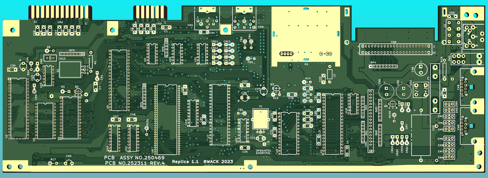
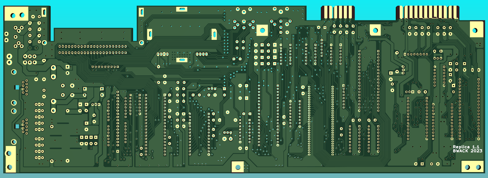

# The C64C 250469 KiCAD replica

A replica of the Commodore 64 250469 motherboard, and schematics. Reverse engineered using KiCAD and photos of PCBs.

## Interactive BOM

For assembling and BOM list, see the interactive html bom.
The .csv file includes also additional parts, like fuse clips and ic sockets.

## Schematics

[C64-250469-KiCad.pdf](C64-250469-KiCad.pdf)

## YouTube

Check out these playlists of videos for my c64 motherboard projects:

* [C64C](https://www.youtube.com/playlist?list=PLtQOf_JULmrRxewUc_WUPFes85R2VS0OV)
* [250407](https://www.youtube.com/playlist?list=PLtQOf_JULmrTjnf6mLVKhRkkNlOATiyTX)
* [KU](https://www.youtube.com/playlist?list=PLtQOf_JULmrTGLZCElGG_T1a01JSDP0CP)

I want to thank Tommy Ovesen, Arctic Retro, for helping me with finding components and building it.
Check out his videos about this board here:

* [SPECIAL UNBOXING - BWACK's brand new 2023 C64C Rev 4 Motherboard Replica Prototype](https://www.youtube.com/watch?v=X3wnqtAdsNw)
* [Part 1 - Prepare and start soldering](https://www.youtube.com/watch?v=k9U1iy2JSg4)
* [Part 2 - Will it work?](https://www.youtube.com/watch?v=0MrF4Lym-Ks)
* [Part 3 - Fixing issues and making a case](https://www.youtube.com/watch?v=E9nOs_wmgxU)

## Discrepancies in Layout and Schematics

Many inconsistencies were found in the schematics and layout.

- Inputs of 4066 in U18 and U21 are named differently.
- Global label INTRES near U6, a INTRES net is crossing, but there is no junction.
- C8 in the schematics is the same as C2 in the layout.
- 9VAC global label seems to point the wrong direction.
- R16 is anonymous in the schematic.
- Power Switch symbols have no reference number and no pin numbers.
- kicad labels will not have slash inside ~{}, but will have them in symbol pin names.
- C59 is missing its reference in the schematics. Schematics says it is C19.
- CASS_RD RP3 pin 8 is actually RP5 pin 8.
- C70 at U2 is actually C30.
- C18 in the schematic is actually C48 on the pcb.
- RP4 pin 9 was not marked with a number in the schematic.
- C45 in the schematic is C65 in the layout.
- Crystal Y1 in the schematics doesn't show the shield grounding and its connection.
- EXT_RESET at the serial port is called EXTRES at U22.
- Diode arrays DA1-4 in the layout was not in the schematics.

Other:
- PB0..7 and PA2 in the schematic share the same net names between to the CIA ICs.

## Change log

- Rev 1.0 (2023-02-21)
This was the prototype shown in the video series.

- Rev 1.1 (2023-05-17)
  - Adjusted position of mounting holes, and power switch.
  - Joystick ports: Mechanical mounting holes changed to plated.
  - Crystal: vias changed to solder pads for grounding.

# License and Disclaimer

Copyright Bwack 2023

This documentation describes Open Hardware and is licensed under the CERN OHL v. 1.2.

You may redistribute and modify this documentation under the terms of theCERN OHL v.1.2. (http://ohwr.org/cernohl). This documentation is distributed WITHOUT ANY EXPRESS OR IMPLIED WARRANTY, INCLUDING OF MERCHANTABILITY, SATISFACTORY QUALITY AND FITNESS FOR APARTICULAR PURPOSE. Please see the CERN OHL v.1.2 for applicable conditions.
